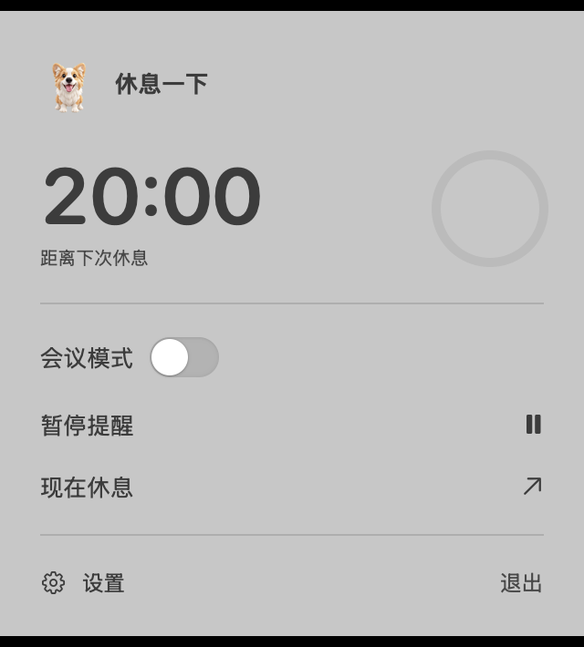
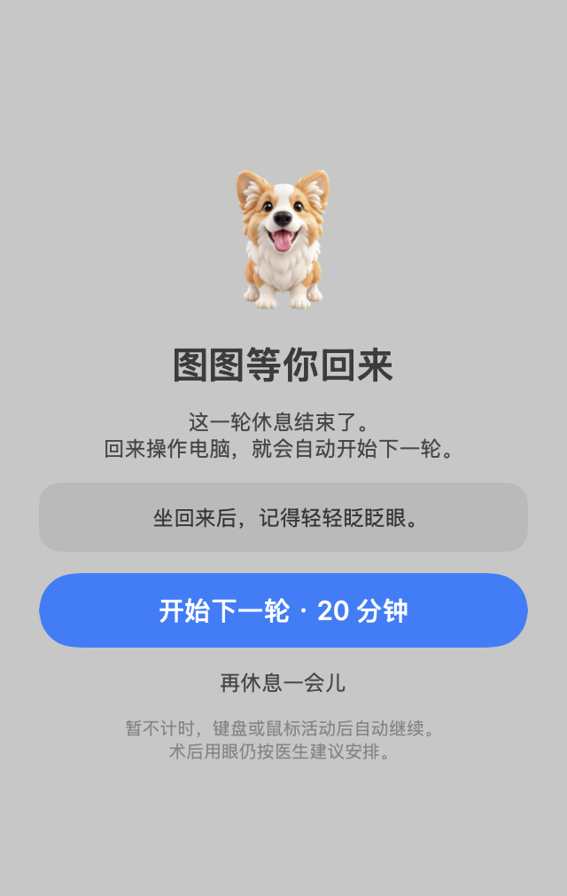
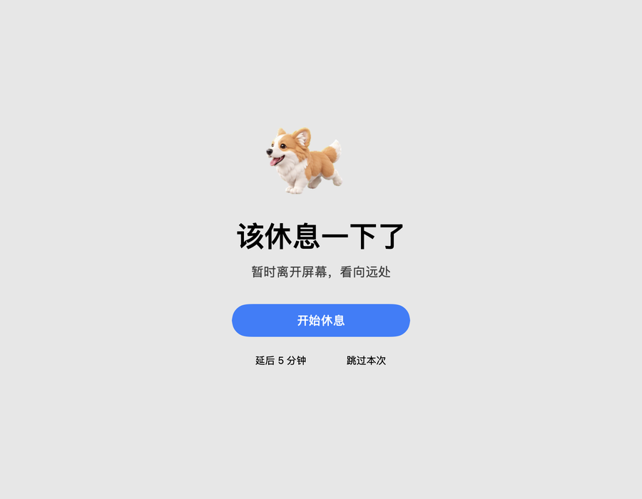
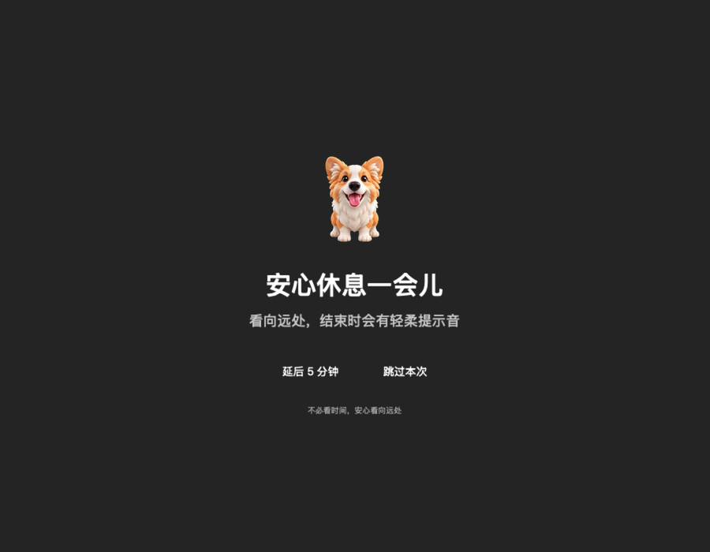
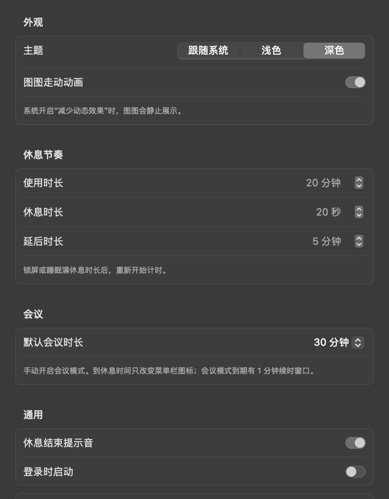
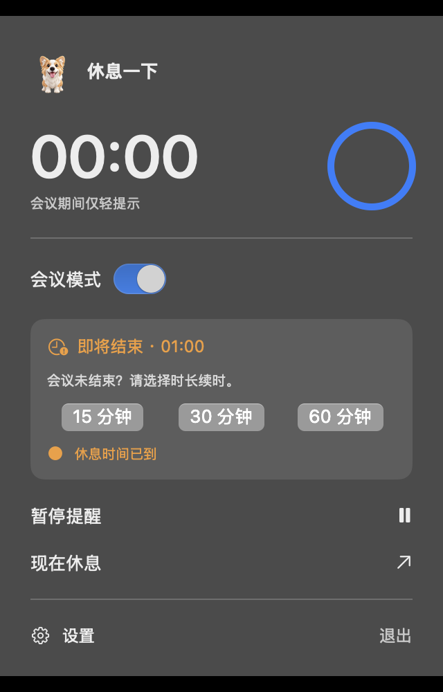

# 休息一下 · Eye Rest

**图图陪你歇一会儿。** 一款原生 macOS 菜单栏休息提醒应用：安心使用电脑，到时间看向远处，回来后自动开始下一轮。

不在菜单栏展示让人紧张的倒计时，不强制锁屏，也不读取你输入的内容。

- **原生体验**：AppKit + SwiftUI，无第三方运行时依赖。
- **温和提醒**：全屏模糊遮罩，支持所有显示器，允许延后或跳过。
- **图图陪伴**：提醒时缓慢走动，休息时坐着看向你，结束后等你回来。
- **少一点打扰**：菜单栏只显示状态；打开弹框才看到数字倒计时。

支持 **macOS 14 及以上**。macOS 26 使用 Clear Liquid Glass 按钮；当前已在 Apple Silicon 上验证。

## 界面预览

<table>
  <tr>
    <th>菜单栏弹框 · 倒计时与图图</th>
    <th>休息完成 · 等你回来</th>
  </tr>
  <tr>
    <td align="center"></td>
    <td align="center"></td>
  </tr>
</table>

### 全屏提醒与休息中的图图

<table>
  <tr>
    <th>到时间，提醒你休息</th>
    <th>开始休息，图图坐着陪你</th>
  </tr>
  <tr>
    <td></td>
    <td></td>
  </tr>
</table>

### 设置与会议模式

<table>
  <tr>
    <th>深色设置 · 自定义休息节奏</th>
    <th>会议到期 · 可以续时</th>
  </tr>
  <tr>
    <td align="center"></td>
    <td align="center"></td>
  </tr>
</table>

> 图片来自当前原生界面的诊断渲染，全屏图仅裁取中央区域，未拼入其他应用或个人桌面内容。窗口服务器的实时桌面模糊与完整玻璃合成无法由这类位图截图完整呈现；实际材质会随桌面内容和系统外观变化。

## 当前功能

| 功能 | 行为 |
| --- | --- |
| 菜单栏常驻 | 沙漏表示计时、茶杯表示休息，另有完成等待、暂停、会议和到期状态；图标和悬浮说明不展示数字倒计时 |
| 倒计时弹框 | 点击菜单栏后查看剩余时间、进度环、图图图片，以及会议、暂停、设置入口 |
| 全屏休息提醒 | 覆盖全部显示器；柔和模糊桌面，不叠加厚重黑色卡片，不强制锁屏 |
| 主动休息 | 点击「开始休息」才开始休息计时；图图停止走动、坐着陪你，不消失；遮罩不展示秒数 |
| 休息打断检测 | 按键、点击、滚动会重新累计休息时长；**仅移动鼠标不算打断** |
| 回来自动计时 | 休息完成后收起遮罩，显示等待弹框；新的按键、点击、滚动、鼠标移动或拖动会自动开启完整下一轮 |
| 手动开始下一轮 | 等待时仍可点击「开始下一轮」；「再休息一会儿」只收起弹框，之后的新活动仍可自动开始 |
| 延后 / 跳过 | 延后是在一段时间后再次提醒；跳过是直接开启新的完整使用周期 |
| 手动会议模式 | 选择 15 / 30 / 60 分钟；继续累计使用时间，到期仅改变菜单栏图标，不弹休息遮罩、不发声 |
| 会议续时 | 会议模式到期后保留 1 分钟续时窗口，未续时再恢复普通提醒 |
| 暂停 / 恢复 | 暂停后保留剩余时间；键鼠活动不会自动解除手动暂停 |
| 锁屏 / 睡眠 | 暂停累计使用时间；使用阶段离开达到休息时长后重新开始完整周期；已完成休息时，仅解锁不会代替新的活动 |
| 外观与辅助功能 | 跟随系统 / 浅色 / 深色；可关闭图图走动；遵守系统「减少动态效果」和「减少透明度」设置 |
| 提示音与登录启动 | 可选轻柔休息结束提示音；登录启动默认关闭，可在设置中开启 |

### 默认节奏

| 项目 | 默认值 | 可调整范围 |
| --- | --- | --- |
| 连续使用时长 | 20 分钟 | 1–120 分钟 |
| 主动休息时长 | 20 秒 | 10–300 秒 |
| 延后时长 | 5 分钟 | 1–30 分钟 |
| 会议时长 | 30 分钟 | 15 / 30 / 60 分钟 |

普通阅读时，即使没有键鼠操作，也继续累计使用时间。应用不会把「没有输入」直接判断为一次休息完成。

## 快速开始

目前提供源码和本地构建脚本，**尚未提供经过 Developer ID 签名、公证的安装包**。

### 1. 准备构建环境

- macOS、Apple Command Line Tools 或完整 Xcode。
- 构建机需要包含 **macOS 26 或更新 SDK** 的工具链，以编译 Liquid Glass API；最低运行版本仍为 macOS 14。
- 无需安装第三方 Swift 包。

若未安装 Command Line Tools，可先运行：

```sh
xcode-select --install
```

确认工具链和 SDK：

```sh
swift --version
xcrun --show-sdk-version
```

### 2. 获取源码并构建

```sh
git clone https://github.com/callqh/eye-rest.git
cd eye-rest
./scripts/build-app.sh
```

构建产物位于 `build/休息一下.app`。脚本会打包图图资源、生成图标，并进行本地临时签名与签名校验。

### 3. 安装并运行

```sh
./scripts/install-local.sh
open "$HOME/Applications/休息一下.app"
```

也可以将构建出的应用拖入自己的「应用程序」目录。应用没有 Dock 主窗口，启动后请在**菜单栏寻找沙漏图标**；首次打开会展示弹框。

本地临时签名不等同于 Apple 公证。如果系统阻止打开，请先确认源码及构建来源，再按照 macOS 的安全提示处理；不需要关闭系统安全保护。

### 4. 体验一轮休息

1. 点击菜单栏图标，选择「现在休息」。
2. 在全屏提示中点击「开始休息」，看向远处，暂时不操作键盘、点击或滚动。
3. 达到休息时长后，遮罩收起，图图在弹框中等你回来。
4. 继续操作电脑，自动开始下一轮；也可以手动点击「开始下一轮」。

每次重新启动应用会从新的使用周期开始，暂不保存退出前的剩余时间。

## 隐私与权限

- 使用 Core Graphics 的**会话事件计数**及本应用的局部事件判断活动。
- **不读取输入文字、按键内容、屏幕图像、录音或会议内容。** 桌面模糊是系统材质合成，不是应用截屏。
- 偏好设置存储在本机；当前代码不包含账号系统、分析统计或网络上传逻辑。
- 不使用全局键盘事件 tap；登录启动由系统 `SMAppService` 管理，只有用户主动开启才注册。
- 诊断截图仅渲染应用自己的界面，不采集桌面；诊断模式不修改保存的偏好或注册登录启动。

应用是日常休息提醒工具，**不是医疗设备或治疗方案**；有特殊用眼安排时，请遵循医生建议。

## 开发与验证

运行独立状态机检查：

```sh
swift run -c release RestEngineChecks
```

运行原生烟雾检查（会短暂展示设置和双屏遮罩，完成后自动退出）：

```sh
./scripts/build-app.sh
mkdir -p build/verification
"build/休息一下.app/Contents/MacOS/EyeRest" \
  --smoke-test --output "$PWD/build/verification"
```

目前已通过 **16 项核心规则检查**，以及双屏窗口、真实计时器、休息打断、活动计数、状态图标、会议续时和完成后自动开始下一轮的原生检查。实际锁屏 / 睡眠通知、其他应用的全屏 Space、登录启动与旧系统兼容性仍需要实机验证。

详细说明见 [验证指南](<docs/testing.md>) 和 [行为规则](<docs/behavior.md>)。

### 项目结构

```text
Sources/
├── EyeRestCore/RestEngine.swift       # 独立计时状态机
└── EyeRestApp/
    ├── AppModel.swift                # 偏好、活动计数、系统生命周期
    ├── Views.swift                   # 弹框、设置、全屏提醒和图图
    ├── main.swift                    # AppKit 窗口、菜单栏与诊断入口
    └── Resources/tutu-spritesheet.png
Tests/EyeRestCoreTests/               # 可直接运行的规则检查
scripts/                             # 构建、图标生成、个人目录安装
docs/                                # 中文行为文档、验证指南与界面图片
```

## 当前限制与后续方向

- 会议模式为手动开启，**尚未实现飞书等会议软件的自动识别**。
- 当前仅在 Apple Silicon 上构建和验证，未验证 Intel Mac。
- macOS 14 / 15 采用兼容材质，Liquid Glass 仅在 macOS 26 及以上生效；旧系统未完成实机验证。
- 暂无自动更新、跨设备同步、退出后计时恢复和正式公证安装包。

欢迎通过 [Issues](https://github.com/callqh/eye-rest/issues) 反馈问题。请附上 macOS 版本、应用状态、复现步骤和必要的界面截图，注意遮挡个人信息。

## 许可证与素材

当前仓库暂未附加开源许可证。**公开可见不代表已授权任意再分发或商业使用**；代码与图图图片的使用、再分发授权需另行确认。图图素材随应用提供用于当前产品展示，不应默认视为通用素材库。
